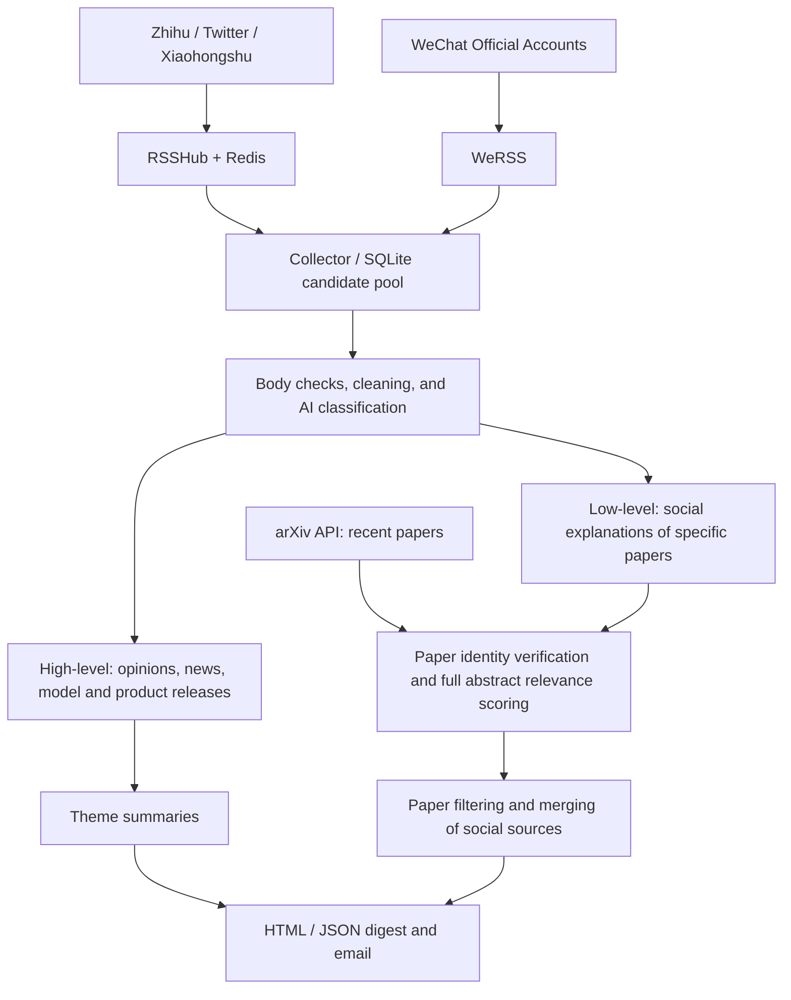

# TrendRadar: Social Developments and Research Papers

[中文](README.md) | **English**

This is my personal monitoring tool built on [TrendRadar](https://github.com/sansan0/TrendRadar), combining and extending RSSHub, WeRSS, and ideas from the Paper-Pulse reference repository under `external/`. It follows both **high-level public discourse and industry developments** and **low-level research papers**: what communities are discussing, what is changing, and which concrete methods and research contributions sit behind those discussions.

The main platforms deployed and integrated are **Zhihu, Twitter / X, Xiaohongshu, and WeChat Official Accounts**, with additional paper discovery through the arXiv API. Collected content enters a local candidate pool, is classified, filtered, and deduplicated, and becomes a daily email with social themes and paper recommendations.

## Components and attribution

| Project / module | Role | Integration |
| --- | --- | --- |
| [TrendRadar](https://github.com/sansan0/TrendRadar) | Base project, AI client, existing news/RSS/report capabilities | Extended from the upstream project |
| [RSSHub](https://github.com/Luoyu126/RSSHub) (upstream: [DIYgod/RSSHub](https://github.com/DIYgod/RSSHub)) | Converts Zhihu, Twitter, and Xiaohongshu account content to RSS | `external/RSSHub/` is a Git submodule, built locally as a separate service |
| [WeRSS / we-mp-rss](https://github.com/rachelos/we-mp-rss) | WeChat QR authorization, account subscriptions, and RSS output | Local source under `external/we-mp-rss/`; the current Compose deployment uses a published image |
| [Paper-Pulse](https://github.com/yangjunx21/Paper-Pulse) | Reference for staged paper discovery and filtering | `external/Paper-Pulse/` is an independent reference clone, not a runtime dependency; paper logic is independently implemented in `trendradar/papers/` |
| `trendradar/content_pool/` | Candidates, classification into two sections, summaries, delivery records, and recovery | Unified workflow added in this repository |

The Paper-Pulse reference revision is `f05147ac12eab8ffd7b84a7d44e819678d512e03`; its source code and prompts were not copied. See the [paper module documentation](docs/paper-recommendations.md). This repository retains [GPL-3.0](LICENSE); external projects retain their respective licenses.

## How the two levels work



- **High-level:** retains the author, platform, main points, and source URL, grouped into themes for following discussions and industry developments. The current implementation summarizes daily content; it has no separate sentiment index or event evolution prediction model.
- **Low-level:** discovers papers on arXiv and identifies papers discussed in social posts. It verifies arXiv identity, scores the official complete abstract against research interests, and merges social explanations of the same paper. It does not download PDFs or analyze paper full text.
- **Unified digest:** currently configured for up to six social themes and ten papers. Primary content uses publication times from the previous calendar day in `America/New_York`; late arrivals and older undelivered items are labeled supplemental.
- **Recovery:** SQLite stores content and processing state, with reusable classification and scoring caches. Interrupted or budget-limited work can resume. Once SMTP accepts delivery for all recipients, the batch's bodies and reports are removed while deduplication and delivery records remain.

## Deployment

The current deployment uses **Python on a Linux host, Docker services for collection, and systemd user timers**. Run the commands below from the repository root. The original local checkout is `/home/chenyy/TrendRadar`; another directory works too. Requirements are Python 3.12+, Git, Docker Compose, and network access to the platforms, arXiv, your model endpoint, and SMTP server.

### 1. Prepare the code and Python environment

```bash
git clone https://github.com/Luoyu126/TrendRadar.git
cd TrendRadar
git submodule update --init --recursive
python3.12 -m venv .venv
.venv/bin/python -m pip install -e .
```

Skip cloning for an existing checkout. The RSSHub submodule uses an SSH URL and requires working local GitHub SSH access; see [external repository instructions](external/README.md) for a nondefault key. The other two external repositories are independent local clones, so submodule initialization does not download them. Their local source is not required by the current runtime.

On Ubuntu with systemd, if Docker is not installed, the repository includes an installer:

```bash
sudo bash scripts/install_docker_ubuntu.sh
```

### 2. Deploy RSSHub for Zhihu, Twitter, and Xiaohongshu

Create the local environment file on first setup. Edit existing files in place to preserve credentials:

```bash
cp -n docker/rsshub.env.example docker/rsshub.env
chmod 600 docker/rsshub.env
```

Set your own login credentials in `docker/rsshub.env`:

```dotenv
XIAOHONGSHU_COOKIE='complete Xiaohongshu request Cookie value'
ZHIHU_COOKIES='complete Zhihu request Cookie value'
TWITTER_AUTH_TOKEN='only the auth_token value from Twitter cookies'
```

Log in to each platform in your browser and obtain the request Cookie from the developer tools Network panel. A complete Cookie value excludes the `Cookie:` prefix. For Twitter, supply only the `auth_token` value.

```bash
sudo docker compose -f docker/docker-compose.rsshub.yml up -d --build
curl --fail http://127.0.0.1:1200/healthz
```

This Compose configuration builds the browser-equipped image from `external/RSSHub/`, starts RSSHub and Redis, and publishes RSSHub only at `127.0.0.1:1200`. Redis is an upstream cache; the persistent content pool is SQLite on the host. After updating cookies, recreate the service with the following command; source changes require another `--build`:

```bash
sudo docker compose -f docker/docker-compose.rsshub.yml up -d --no-build
```

### 3. Deploy WeRSS for WeChat Official Accounts

Create or edit local `docker/werss.env` with an administrator username and your own password:

```dotenv
USERNAME=admin
PASSWORD=replace_with_your_own_password
```

```bash
chmod 600 docker/werss.env
sudo docker compose -f docker/docker-compose.werss.yml up -d
```

The current deployment uses `ghcr.io/rachelos/we-mp-rss:latest`, serves its management UI at `http://127.0.0.1:8001`, and persists data under `output/werss/`. Open the UI, log in, complete QR authorization, add official accounts, and verify article updates. Copy the RSS subscription URLs generated by the service.

For a remote server, access its management UI through an SSH tunnel from your computer:

```bash
ssh -L 8001:127.0.0.1:8001 user@your-server
```

Put the RSS URLs in `wechat.feeds` below. The collector reads WeRSS directly. The code also retains RSSHub's `/wechat/sogou/:id` route through `wechat.accounts`; earlier local checks returned incomplete results such as old article snippets, so the daily WeChat integration uses WeRSS.

### 4. Configure monitored accounts

```bash
cp -n config/content_sources.yaml config/content_sources.local.yaml
```

Edit `config/content_sources.local.yaml`, for example:

```yaml
rsshub_url: http://127.0.0.1:1200
database: output/content_pool/content.sqlite3
timezone: America/New_York
poll_interval_minutes: 30
request_timeout_seconds: 120

zhihu:
  accounts:
    - https://www.zhihu.com/people/su-jian-lin-22
twitter:
  include_replies: false
  include_retweets: true
  accounts:
    - https://x.com/karpathy
xiaohongshu:
  accounts: [] # Full profile URLs or 24-character user IDs from profile URLs
wechat:
  accounts: []
  feeds:
    - id: almosthuman2014
      url: http://127.0.0.1:8001/feed/REPLACE_WITH_REAL_FEED_ID.xml
```

Accounts above illustrate the format; replace them with your own subscriptions. Replace the WeRSS feed ID with the actual generated value. The shared template enables no accounts by default. `sources_config` in `config/content_pool.yaml` already points to this local file.

| Platform | Collection route | Scope |
| --- | --- | --- |
| Zhihu | `/zhihu/people/answers/<id>`, `/zhihu/posts/people/<id>` | Authored answers and articles; excludes likes, follows, and thoughts |
| Twitter / X | `/twitter/user/<username>/includeReplies=0&includeRts=1` | User timeline; replies and retweets are configurable |
| Xiaohongshu | `/xiaohongshu/user/<24-character-user-ID>/notes` | User notes; profile short links are not accepted directly |
| WeChat Official Accounts | WeRSS URLs in `wechat.feeds` | Articles from authorized and subscribed accounts |

### 5. Configure AI, research interests, and email

The unified runner automatically reads `config/ai.local.env` and `config/email.local.env`; existing environment variables take priority. AI settings reuse the `ai` section of `config/config.yaml`, with local overrides such as:

```dotenv
# config/ai.local.env
AI_MODEL=openai/your-model-name
AI_API_BASE=https://your-api-endpoint/v1
AI_API_KEY=your_api_key
LITELLM_LOCAL_MODEL_COST_MAP=True
```

Use the provider/model format understood by AIClient / LiteLLM. The endpoint must support JSON object output. Omit `AI_API_BASE` when your provider does not require a custom endpoint.

```dotenv
# config/email.local.env
EMAIL_FROM=sender@example.com
EMAIL_PASSWORD=your_smtp_password_or_app_password
EMAIL_TO=reader@example.com
EMAIL_SMTP_SERVER=smtp.example.com
EMAIL_SMTP_PORT=465
```

Separate multiple recipients with commas. Port `465` uses SSL; other ports use STARTTLS. The unified email sender reads SMTP settings from environment variables, so configure them in this local file or the process environment.

```bash
chmod 600 config/ai.local.env config/email.local.env
```

Update `research_question`, `topics`, and `arxiv_query` in `config/papers.yaml` for your research interests. Paper screening is currently enabled with a reinforcement learning focus: a seven-day lookback, up to 200 discovery candidates, a relevance threshold of `0.7`, and up to ten papers per day. Papers below the threshold are not included to fill a quota.

`config/content_pool.yaml` controls the timezone, budgets, theme count, and model request interval. Model calls are currently serial, at least 30 seconds apart, with persistent cooldown after rate limiting. `email_link_mode: plain_address` displays copyable source addresses without protocol prefixes in email; use `full` for ordinary clickable links. Local HTML / JSON retains complete URLs.

Credential files, personal subscriptions, and runtime data are Git-ignored. Keep actual cookies, API keys, and email passwords out of shared configuration.

### 6. Collect, preview, and send

```bash
# Collect raw candidates only: no model calls or email
.venv/bin/python scripts/collect_content.py --config config/content_sources.local.yaml collect
.venv/bin/python scripts/collect_content.py --config config/content_sources.local.yaml status

# Small live collection, AI screening, and preview; calls APIs but sends no email
.venv/bin/python scripts/run_content_daily.py --trial

# Regular collection, screening, and digest preparation; no sending by default
.venv/bin/python scripts/run_content_daily.py

# After reviewing the printed batch_id and HTML, send that existing batch
.venv/bin/python scripts/run_content_daily.py --send --deliver-batch BATCH_ID
```

Replace `BATCH_ID` with the actual output value. Previews are written to `output/content_pool/reports/`; after all deliveries succeed, batch reports are cleaned up with their content. SMTP acceptance is not proof of arrival in an inbox. Uncertain delivery outcomes are not automatically retried.

Use `--collect-only` to collect and screen without preparing a digest. Use `--skip-collect` to resume retained candidates without fetching social feeds again (paper discovery still runs). For a platform retry, use `collect --platform twitter --resume`; this skips sources whose latest status is successful or partial, so it is for recovery rather than regular refreshes.

### 7. Install daily timers

After checking the preview, recipients, and a manual delivery:

```bash
mkdir -p output/content_pool
.venv/bin/python scripts/install_content_timers.py
systemctl --user list-timers 'trendradar-content-*' --no-pager
```

The installer copies templates from `deploy/systemd/` to `~/.config/systemd/user/`, substitutes the current checkout path, and immediately enables two timers:

| Timer | Default time (America/New_York) | Action |
| --- | --- | --- |
| `trendradar-content-collect.timer` | 02:00, with up to 120 seconds of random delay | Collect, screen, and prepare the digest |
| `trendradar-content-daily.timer` | 08:00 | Deliver prepared content with `--send-ready --send`, without recollection or rescoring |

File locks serialize both tasks; the timezone handles daylight saving time. Enable lingering if the user services should continue after logout:

```bash
sudo loginctl enable-linger "$USER"
journalctl --user -u trendradar-content-collect.service -n 80 --no-pager
journalctl --user -u trendradar-content-daily.service -n 80 --no-pager
```

The host must remain powered on and connected. `Persistent=true` triggers missed runs after service recovery. To change the schedule timezone, update both the configuration timezone and the timers' `OnCalendar` entries, then reinstall. `poll_interval_minutes` only controls foreground `collect --watch` polling, not these daily timers.

## Data, limitations, and maintenance

| Path | Contents |
| --- | --- |
| `output/content_pool/content.sqlite3` | Candidates, selected content, processing caches, digest batches, and delivery records |
| `output/content_pool/reports/` | HTML / JSON digests awaiting cleanup |
| `output/papers/state.sqlite3` | Separately retained paper metadata and scoring cache |
| `output/werss/` | Persistent WeRSS data |

Platform routes primarily return recent windows, without complete historical pagination. Expired cookies, rate limits, and degraded article bodies can cause gaps; `success` or HTTP 200 does not prove complete daily coverage. Media links are retained without downloading or OCR. AI summaries and scores assist selection; consult the original source for specific conclusions.

This README describes this branch's unified workflow. The original `python -m trendradar`, upstream Docker, and GitHub Actions entry points remain in the repository, but do not automatically replace the unified scheduler above. Platform documents include historical notes from the earlier collection-only stage; read them alongside the current [content pool workflow](docs/content-pool-workflow.md).

- [Content pool, digests, recovery, and cleanup](docs/content-pool-workflow.md) (Chinese)
- [Paper filtering implementation and offline verification](docs/paper-recommendations.md)
- [Zhihu](docs/zhihu-content-pool.md) · [Twitter / X](docs/twitter-content-pool.md) · [Xiaohongshu](docs/xiaohongshu-content-pool.md) · [WeChat](docs/wechat-content-pool.md) (Chinese)
- [External repositories and RSSHub submodule maintenance](external/README.md) (Chinese)
- [Upstream TrendRadar and general usage documentation](https://github.com/sansan0/TrendRadar)
