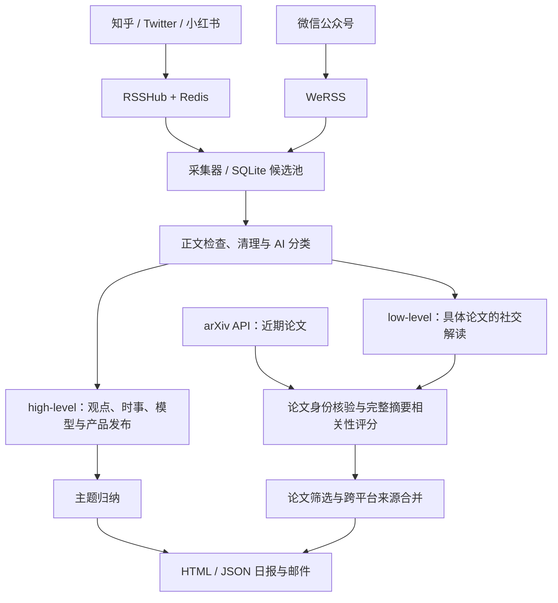

> GitHub 托管定时采集与纽约早间日报（Supabase）：见 [部署与验证步骤](docs/github-actions-supabase.md)。

# TrendRadar：舆情与论文追踪

**中文** | [English](README-EN.md)

这是我基于 [TrendRadar](https://github.com/sansan0/TrendRadar)，结合 `external/` 中的 RSSHub、WeRSS 和 Paper-Pulse 参考仓库拼接、扩展的一套个人信息监控工具。目标是同时追踪 **high-level 的舆情发展**与 **low-level 的论文成果**：既看社区在讨论什么、行业出现了什么变化，也追到具体论文的方法与研究贡献。

当前主要部署和接入的平台是 **知乎、Twitter / X、小红书、微信公众号**，另通过 arXiv API 获取论文。内容先进入本地候选池，再分类、筛选、去重，最终汇成一封包含「舆情主题」和「论文推荐」的日报邮件。

## 项目组成

| 项目 / 模块 | 在本项目中的作用 | 集成方式 |
| --- | --- | --- |
| [TrendRadar](https://github.com/sansan0/TrendRadar) | 基础工程、AI 客户端及原有新闻/RSS/报告能力 | 在上游项目上扩展 |
| [RSSHub](https://github.com/Luoyu126/RSSHub)（上游 [DIYgod/RSSHub](https://github.com/DIYgod/RSSHub)） | 将知乎、Twitter、小红书账号内容转换为 RSS | `external/RSSHub/` 是 Git 子模块，从本地源码构建独立服务 |
| [WeRSS / we-mp-rss](https://github.com/rachelos/we-mp-rss) | 微信扫码授权、公众号订阅与 RSS 输出 | `external/we-mp-rss/` 为本地源码；当前 Compose 使用发布镜像 |
| [Paper-Pulse](https://github.com/yangjunx21/Paper-Pulse) | 论文发现、分阶段筛选的思路参考 | `external/Paper-Pulse/` 为独立参考克隆，不是运行依赖；论文逻辑独立实现在 `trendradar/papers/` |
| `trendradar/content_pool/` | 候选管理、两层分流、主题汇总、投递记录与恢复 | 本仓库新增的统一流程 |

Paper-Pulse 参考版本为 `f05147ac12eab8ffd7b84a7d44e819678d512e03`，未复制其源码或提示词；具体说明见[论文模块文档](docs/paper-recommendations.md)。主仓库沿用 [GPL-3.0](LICENSE)，各外部项目保留自己的许可。

## 两层监控如何工作



- **High-level**：保留作者、平台、主要观点和原文链接，按主题聚合，帮助持续观察讨论与行业动态。当前是每日内容归纳，没有单独的情绪指数或事件演化预测模型。
- **Low-level**：从 arXiv 发现新论文，也从社交内容中识别论文；核验 arXiv 身份，使用官方完整摘要与研究兴趣评分，同一论文的不同平台解读合并展示。当前不下载 PDF、不做论文全文分析。
- **统一日报**：当前配置最多六个舆情主题、十篇论文。按 `America/New_York` 上一自然日的发布时间选取主要内容，晚到或此前未投递的旧内容标为补充。
- **可恢复处理**：正文与处理状态保存在 SQLite，分类和评分可复用缓存；API 故障或预算耗尽后可续跑。全部收件人投递被 SMTP 接受后，清理该批正文和报告，保留去重与投递记录。

## 我搜集的账号列表（仅供参考）

下面是我目前搜集并加入本地订阅配置的账号，**仅供大家参考，可按个人兴趣增删**。收录不代表对账号内容的背书，也不代表每个账号都已验证可稳定采集；共享配置模板仍默认不启用任何账号。

### 微信公众号（3 个）

可在微信内按名称或微信号搜索，再通过 WeRSS 添加订阅；RSS 地址以自己的 WeRSS 实例生成的值为准。

| 公众号 | 微信号 |
| --- | --- |
| 机器之心 | `almosthuman2014` |
| 量子位 | `qbitai` |
| 新智元 | `ai_era` |

### 小红书（5 个）

按主页用户 ID 列出，点击可查看对应账号。

| 账号 / 主页标识 | 主页 |
| --- | --- |
| `60c844e40000000020028672` | [查看主页](https://www.xiaohongshu.com/user/profile/60c844e40000000020028672) |
| `62c98736000000001501e075` | [查看主页](https://www.xiaohongshu.com/user/profile/62c98736000000001501e075) |
| `670450b5000000001d020d62` | [查看主页](https://www.xiaohongshu.com/user/profile/670450b5000000001d020d62) |
| `5f709b34000000000100a497` | [查看主页](https://www.xiaohongshu.com/user/profile/5f709b34000000000100a497) |
| `616c409900000000020251fa` | [查看主页](https://www.xiaohongshu.com/user/profile/616c409900000000020251fa) |

### Twitter / X（62 个）

| 账号 / 主页标识 | 主页 |
| --- | --- |
| `@OpenAI` | [查看主页](https://x.com/OpenAI) |
| `@OpenAIDevs` | [查看主页](https://x.com/OpenAIDevs) |
| `@OpenAINewsroom` | [查看主页](https://x.com/OpenAINewsroom) |
| `@ChatGPTapp` | [查看主页](https://x.com/ChatGPTapp) |
| `@AnthropicAI` | [查看主页](https://x.com/AnthropicAI) |
| `@claudeai` | [查看主页](https://x.com/claudeai) |
| `@GoogleDeepMind` | [查看主页](https://x.com/GoogleDeepMind) |
| `@GoogleAI` | [查看主页](https://x.com/GoogleAI) |
| `@GoogleAIStudio` | [查看主页](https://x.com/GoogleAIStudio) |
| `@deepseek_ai` | [查看主页](https://x.com/deepseek_ai) |
| `@xai` | [查看主页](https://x.com/xai) |
| `@grok` | [查看主页](https://x.com/grok) |
| `@AIatMeta` | [查看主页](https://x.com/AIatMeta) |
| `@MistralAI` | [查看主页](https://x.com/MistralAI) |
| `@Alibaba_Qwen` | [查看主页](https://x.com/Alibaba_Qwen) |
| `@Kimi_Moonshot` | [查看主页](https://x.com/Kimi_Moonshot) |
| `@MiniMax_AI` | [查看主页](https://x.com/MiniMax_AI) |
| `@MicrosoftAI` | [查看主页](https://x.com/MicrosoftAI) |
| `@MSFTResearch` | [查看主页](https://x.com/MSFTResearch) |
| `@NVIDIAAI` | [查看主页](https://x.com/NVIDIAAI) |
| `@NVIDIAAIDev` | [查看主页](https://x.com/NVIDIAAIDev) |
| `@huggingface` | [查看主页](https://x.com/huggingface) |
| `@cohere` | [查看主页](https://x.com/cohere) |
| `@scale_AI` | [查看主页](https://x.com/scale_AI) |
| `@perplexity_ai` | [查看主页](https://x.com/perplexity_ai) |
| `@allen_ai` | [查看主页](https://x.com/allen_ai) |
| `@SakanaAILabs` | [查看主页](https://x.com/SakanaAILabs) |
| `@NousResearch` | [查看主页](https://x.com/NousResearch) |
| `@togethercompute` | [查看主页](https://x.com/togethercompute) |
| `@SSI` | [查看主页](https://x.com/SSI) |
| `@cursor_ai` | [查看主页](https://x.com/cursor_ai) |
| `@cognition_labs` | [查看主页](https://x.com/cognition_labs) |
| `@StabilityAI` | [查看主页](https://x.com/StabilityAI) |
| `@runwayml` | [查看主页](https://x.com/runwayml) |
| `@karpathy` | [查看主页](https://x.com/karpathy) |
| `@elonmusk` | [查看主页](https://x.com/elonmusk) |
| `@sama` | [查看主页](https://x.com/sama) |
| `@DarioAmodei` | [查看主页](https://x.com/DarioAmodei) |
| `@demishassabis` | [查看主页](https://x.com/demishassabis) |
| `@ilyasut` | [查看主页](https://x.com/ilyasut) |
| `@ylecun` | [查看主页](https://x.com/ylecun) |
| `@drfeifei` | [查看主页](https://x.com/drfeifei) |
| `@AndrewYNg` | [查看主页](https://x.com/AndrewYNg) |
| `@DrJimFan` | [查看主页](https://x.com/DrJimFan) |
| `@polynoamial` | [查看主页](https://x.com/polynoamial) |
| `@natolambert` | [查看主页](https://x.com/natolambert) |
| `@lilianweng` | [查看主页](https://x.com/lilianweng) |
| `@fchollet` | [查看主页](https://x.com/fchollet) |
| `@_jasonwei` | [查看主页](https://x.com/_jasonwei) |
| `@tri_dao` | [查看主页](https://x.com/tri_dao) |
| `@JeffDean` | [查看主页](https://x.com/JeffDean) |
| `@gdb` | [查看主页](https://x.com/gdb) |
| `@johnschulman2` | [查看主页](https://x.com/johnschulman2) |
| `@AravSrinivas` | [查看主页](https://x.com/AravSrinivas) |
| `@alexandr_wang` | [查看主页](https://x.com/alexandr_wang) |
| `@mustafasuleyman` | [查看主页](https://x.com/mustafasuleyman) |
| `@percyliang` | [查看主页](https://x.com/percyliang) |
| `@pabbeel` | [查看主页](https://x.com/pabbeel) |
| `@svlevine` | [查看主页](https://x.com/svlevine) |
| `@chelseabfinn` | [查看主页](https://x.com/chelseabfinn) |
| `@aviral_kumar2` | [查看主页](https://x.com/aviral_kumar2) |
| `@dwarkesh_sp` | [查看主页](https://x.com/dwarkesh_sp) |

### 知乎（16 个）

| 账号 / 主页标识 | 主页 |
| --- | --- |
| `su-jian-lin-22` | [查看主页](https://www.zhihu.com/people/su-jian-lin-22) |
| `tian-yuan-dong` | [查看主页](https://www.zhihu.com/people/tian-yuan-dong) |
| `zhang-jun-lin-76` | [查看主页](https://www.zhihu.com/people/zhang-jun-lin-76) |
| `li-bo-jie` | [查看主页](https://www.zhihu.com/people/li-bo-jie) |
| `wan-shang-zhu-ce-de` | [查看主页](https://www.zhihu.com/people/wan-shang-zhu-ce-de) |
| `billmatrix` | [查看主页](https://www.zhihu.com/people/billmatrix) |
| `wabjpz` | [查看主页](https://www.zhihu.com/people/wabjpz) |
| `yahah-97` | [查看主页](https://www.zhihu.com/people/yahah-97) |
| `rumor-lee` | [查看主页](https://www.zhihu.com/people/rumor-lee) |
| `who-u` | [查看主页](https://www.zhihu.com/people/who-u) |
| `sikila` | [查看主页](https://www.zhihu.com/people/sikila) |
| `summer-clover` | [查看主页](https://www.zhihu.com/people/summer-clover) |
| `naiyan-wang` | [查看主页](https://www.zhihu.com/people/naiyan-wang) |
| `mli65` | [查看主页](https://www.zhihu.com/people/mli65) |
| `tsxiyao` | [查看主页](https://www.zhihu.com/people/tsxiyao) |
| `chenweiphd` | [查看主页](https://www.zhihu.com/people/chenweiphd) |

## 部署方式

当前采用 **Linux 宿主机 Python + Docker 采集服务 + systemd 用户定时任务**。以下命令在仓库根目录执行；本机路径为 `/home/chenyy/TrendRadar`，其他机器可以使用自己的目录。需要 Python 3.12+、Git、Docker Compose，以及可访问平台、arXiv、模型接口和 SMTP 的网络。

### 1. 准备代码与 Python 环境

```bash
git clone https://github.com/Luoyu126/TrendRadar.git
cd TrendRadar
git submodule update --init --recursive
python3.12 -m venv .venv
.venv/bin/python -m pip install -e .
```

已有 checkout 可跳过克隆。RSSHub 子模块地址使用 SSH，需要本机已有 GitHub SSH 访问权限；非默认密钥的用法见[外部仓库说明](external/README.md)。另外两个本地外部仓库不是子模块，初始化不会自动下载它们；当前运行不依赖它们的本地源码。

Ubuntu + systemd 尚未安装 Docker 时，可使用仓库自带脚本：

```bash
sudo bash scripts/install_docker_ubuntu.sh
```

### 2. 部署 RSSHub：知乎、Twitter、小红书

首次创建本地配置；已有文件时直接编辑，保留现有凭据：

```bash
cp -n docker/rsshub.env.example docker/rsshub.env
chmod 600 docker/rsshub.env
```

在 `docker/rsshub.env` 中填入自己的登录信息：

```dotenv
XIAOHONGSHU_COOKIE='小红书请求头中完整的 Cookie 值'
ZHIHU_COOKIES='知乎请求头中完整的 Cookie 值'
TWITTER_AUTH_TOKEN='Twitter Cookie 中单独的 auth_token 值'
```

在浏览器登录对应平台后，从开发者工具 Network 的请求头获取 Cookie；完整 Cookie 值不包含 `Cookie:` 前缀。Twitter 只填 `auth_token` 的值。

```bash
sudo docker compose -f docker/docker-compose.rsshub.yml up -d --build
curl --fail http://127.0.0.1:1200/healthz
```

该 Compose 从 `external/RSSHub/` 构建包含浏览器的镜像，启动 RSSHub 与 Redis，并仅将 RSSHub 暴露在 `127.0.0.1:1200`。Redis 是上游缓存，正式内容保存在宿主机 SQLite 中。Cookie 更新后执行下面命令重新创建服务；源码修改则需重新 `--build`：

```bash
sudo docker compose -f docker/docker-compose.rsshub.yml up -d --no-build
```

### 3. 部署 WeRSS：微信公众号

创建或编辑本地 `docker/werss.env`，填入管理员账号和自行设置的密码：

```dotenv
USERNAME=admin
PASSWORD=replace_with_your_own_password
SECRET_KEY=replace_with_a_long_random_secret
```

```bash
chmod 600 docker/werss.env
sudo docker compose -f docker/docker-compose.werss.yml up -d
```

当前使用 `ghcr.io/rachelos/we-mp-rss:latest`，管理页面为 `http://127.0.0.1:8001`，数据持久化到 `output/werss/`。已有部署更新时保留原凭据。当前文章采集使用 **微信读书通道**：

1. 使用 `docker/werss.env` 中的账号密码登录管理页面。
2. 尚未添加公众号时，先通过公众号后台扫码授权，搜索并添加账号；然后进入 **微信读书管理**，完成该通道独立的扫码授权。公众号后台授权不能代替微信读书授权。
3. 将服务生成的 `MP_WXS_*` 订阅 ID 按下方示例配置，并开启 `refresh_werss: true`。每次采集先通过微信读书刷新文章，再读取本地 RSS，保存到内容池。

本机已验证机器之心、量子位、新智元各一篇正文入库。当前实现使用 `/api/mp/cover` 获取最新文章、`/web/mp/content` 获取正文。**每轮只能获取每个公众号最新的一篇**：两轮之间连续发文可能遗漏，无法补抓历史列表。旧 `/web/mp/articles` 接口实测返回错误（机器之心为 `-2041`），不启用该入口。

当前实现会把抓取时间填入 RSS 发布日期。配置 `trust_published_at: false` 后，内容池将发布日期记为未知并标记 `missing_published_at`（状态 `partial`），不会将抓取时间冒充发布时间；这些条目不进入按发布日期查询的结果。授权过期后，到 **微信读书管理** 重新扫码。

部署在远程服务器时，可从自己的电脑通过 SSH 转发访问管理页：

```bash
ssh -L 8001:127.0.0.1:8001 user@your-server
```

在 `wechat.feeds` 中填写本机 WeRSS 地址；自动刷新只接受 localhost 或回环地址。代码保留的搜狗入口 `wechat.accounts` 曾返回旧文章摘要，当前三个公众号不使用该入口。

### 4. 配置监控账号

```bash
cp -n config/content_sources.yaml config/content_sources.local.yaml
```

编辑 `config/content_sources.local.yaml`，例如：

```yaml
rsshub_url: http://127.0.0.1:1200
database: output/content_pool/content.sqlite3
timezone: America/New_York
poll_interval_minutes: 30
request_timeout_seconds: 120

zhihu:
  accounts:
    - https://www.zhihu.com/people/su-jian-lin-22
twitter:
  include_replies: false
  include_retweets: true
  accounts:
    - https://x.com/karpathy
xiaohongshu:
  accounts: [] # 填完整主页链接或主页 URL 中的 24 位用户 ID
wechat:
  accounts: []
  credentials_file: docker/werss.env
  feeds:
    - id: almosthuman2014
      name: 机器之心
      url: http://127.0.0.1:8001/feed/MP_WXS_3073282833.xml
      refresh_werss: true
      trust_published_at: false
    - id: qbitai
      name: 量子位
      url: http://127.0.0.1:8001/feed/MP_WXS_3236757533.xml
      refresh_werss: true
      trust_published_at: false
    - id: ai_era
      name: 新智元
      url: http://127.0.0.1:8001/feed/MP_WXS_3271041950.xml
      refresh_werss: true
      trust_published_at: false
```

账号仅作格式示例，按自己的关注列表替换；公众号订阅 ID 必须替换为 WeRSS 实际生成的值。共享模板默认没有启用任何账号。`config/content_pool.yaml` 的 `sources_config` 已指向这个本地文件。

| 平台 | 实际采集方式 | 范围 |
| --- | --- | --- |
| 知乎 | `/zhihu/people/answers/<id>`、`/zhihu/posts/people/<id>` | 作者回答与文章，不含点赞、关注、想法 |
| Twitter / X | `/twitter/user/<username>/includeReplies=0&includeRts=1` | 用户时间线，回复与转发由配置控制 |
| 小红书 | `/xiaohongshu/user/<24位用户ID>/notes` | 用户笔记；不支持直接填写短链接 |
| 微信公众号 | `wechat.feeds` 中的 WeRSS URL | 微信读书通道，每轮各账号最新一篇；发布日期未知 |

#### 微信公众号每 30 分钟采集

先验证单次采集，再安装独立用户定时器。仓库内服务模板使用 `/home/chenyy/TrendRadar`；其他机器须先修改模板中的项目和 Python 路径再复制。定时器在每小时的 00、30 分钟刷新微信读书并入库，不调用 AI、不发送邮件。

```bash
.venv/bin/python scripts/collect_content.py --config config/content_sources.local.yaml collect --platform wechat
mkdir -p output/content_pool ~/.config/systemd/user
cp deploy/systemd/trendradar-wechat-collect.service ~/.config/systemd/user/
cp deploy/systemd/trendradar-wechat-collect.timer ~/.config/systemd/user/
systemctl --user daemon-reload
systemctl --user enable --now trendradar-wechat-collect.timer
systemctl --user list-timers trendradar-wechat-collect.timer --no-pager
journalctl --user -u trendradar-wechat-collect.service -n 50 --no-pager
```

需要退出登录后继续采集时，执行 `sudo loginctl enable-linger "$USER"`。核对实际入库文章与正文，不能仅凭 HTTP 200 或更新接口返回成功判断采集完成。`poll_interval_minutes: 30` 只控制前台 `collect --watch` 的间隔，不会自动安装后台定时器。

### 5. 配置 AI、研究兴趣与邮件

统一入口自动读取 `config/ai.local.env` 和 `config/email.local.env`；已有环境变量优先。AI 配置复用 `config/config.yaml` 中的 `ai`，本地覆盖示例：

```dotenv
# config/ai.local.env
AI_MODEL=openai/your-model-name
AI_API_BASE=https://your-api-endpoint/v1
AI_API_KEY=your_api_key
LITELLM_LOCAL_MODEL_COST_MAP=True
```

模型名使用 AIClient / LiteLLM 对应的提供商格式，接口须支持 JSON 对象输出。官方提供商不需要自定义地址时可以省略 `AI_API_BASE`。

```dotenv
# config/email.local.env
EMAIL_FROM=sender@example.com
EMAIL_PASSWORD=your_smtp_password_or_app_password
EMAIL_TO=reader@example.com
EMAIL_SMTP_SERVER=smtp.example.com
EMAIL_SMTP_PORT=465
```

多个收件人用逗号分隔。端口 `465` 使用 SSL，其他端口走 STARTTLS。统一邮件发送器从环境变量读取 SMTP 设置，请在这个本地文件或运行环境中配置。

```bash
chmod 600 config/ai.local.env config/email.local.env
```

编辑 `config/papers.yaml` 中的 `research_question`、`topics` 和 `arxiv_query`，换成自己的研究兴趣。当前仓库已启用论文筛选，配置偏向强化学习：回看 7 天，最多发现 200 个候选，相关性阈值 `0.7`，每日最多 10 篇；不为凑数量放行低于阈值的论文。

`config/content_pool.yaml` 控制时区、预算、主题数和模型请求间隔。当前模型调用串行，至少间隔 30 秒，限流后进入持久化冷却。`email_link_mode: plain_address` 将邮件来源显示为不带协议前缀的可复制地址；改为 `full` 可恢复普通可点击链接。本地 HTML / JSON 保留完整链接。

凭据文件、个人订阅与运行数据已配置 Git 忽略，勿将真实 Cookie、API Key 或邮件密码写入共享配置。

### 6. 试采集、预览与发送

```bash
# 仅抓取原始候选，不调用模型、不发送
.venv/bin/python scripts/collect_content.py --config config/content_sources.local.yaml collect
.venv/bin/python scripts/collect_content.py --config config/content_sources.local.yaml status

# 小批量真实采集、AI 筛选及预览；会访问接口，不发送邮件
.venv/bin/python scripts/run_content_daily.py --trial

# 常规采集、筛选并准备日报；默认不发送
.venv/bin/python scripts/run_content_daily.py

# 查看输出的 batch_id 与 HTML 后，发送指定已有批次
.venv/bin/python scripts/run_content_daily.py --send --deliver-batch BATCH_ID
```

`BATCH_ID` 替换为运行输出的实际值。预览位于 `output/content_pool/reports/`；成功完成全部投递后，该批报告会随正文清理。SMTP 接受不等于邮件一定进入收件箱；投递结果不确定时不自动重发。

需要只采集并筛选、不准备日报时用 `--collect-only`；需要从保留候选继续处理时用 `--skip-collect`（仍会运行论文发现流程）。单平台补采可用 `collect --platform twitter --resume`；`--resume` 跳过最近成功或 partial 的来源，只用于补采，不用于常规刷新。

### 7. 安装每日定时任务

完成预览、确认收件人及手动投递后安装：

```bash
mkdir -p output/content_pool
.venv/bin/python scripts/install_content_timers.py
systemctl --user list-timers 'trendradar-content-*' --no-pager
```

安装器将 `deploy/systemd/` 中的模板复制到 `~/.config/systemd/user/`，自动替换为当前 checkout 路径，并立即启用两个定时任务：

| 任务 | 默认时间（America/New_York） | 操作 |
| --- | --- | --- |
| `trendradar-content-collect.timer` | 02:00，随机延迟最多 120 秒 | 采集、筛选并准备日报 |
| `trendradar-content-daily.timer` | 08:00 | 通过 `--send-ready --send` 投递已准备内容，不重新采集或评分 |

两项任务通过文件锁串行运行，时间随夏令时调整。需要用户退出登录后继续运行时启用 linger：

```bash
sudo loginctl enable-linger "$USER"
journalctl --user -u trendradar-content-collect.service -n 80 --no-pager
journalctl --user -u trendradar-content-daily.service -n 80 --no-pager
```

机器仍需保持开机联网；`Persistent=true` 会在恢复后补触发错过的任务。调整运行时区时，同时修改配置中的时区和两个 timer 的 `OnCalendar`，然后重新安装。`poll_interval_minutes` 仅控制 `collect --watch` 的前台轮询间隔，不改变每日 timer。

## 数据、限制与维护

| 路径 | 内容 |
| --- | --- |
| `output/content_pool/content.sqlite3` | 全平台候选、正式池、论文元数据与评分缓存、日报批次和投递记录 |
| `output/content_pool/reports/` | 尚未清理的 HTML / JSON 日报 |
| `output/papers/state.sqlite3` | 旧论文库，仅作为迁移来源保留 |
| `output/werss/` | WeRSS 持久数据 |

当前平台路由主要读取近期内容窗口，没有完整历史翻页补抓。Cookie 失效、平台限流、正文降级都可能造成缺失；`success` 或 HTTP 200 不能证明当天内容抓全。媒体仅保留链接，不下载、不做 OCR。模型摘要与评分用于辅助筛选，需通过原文判断具体结论。

本 README 描述本分支的统一流程；原有 `python -m trendradar`、上游 Docker / GitHub Actions 入口仍在仓库中，但不会自动代替上述统一调度。平台专项文档中关于早期“仅采集”阶段的记录，需结合当前[内容池流程](docs/content-pool-workflow.md)阅读。

- [统一数据库与旧论文库迁移](docs/unified-database.md)
- [内容池、日报、恢复与清理](docs/content-pool-workflow.md)
- [论文筛选实现与离线验证](docs/paper-recommendations.md)
- [知乎](docs/zhihu-content-pool.md) · [Twitter / X](docs/twitter-content-pool.md) · [小红书](docs/xiaohongshu-content-pool.md) · [微信公众号](docs/wechat-content-pool.md)
- [外部仓库与 RSSHub 子模块维护](external/README.md)
- [TrendRadar 上游项目与通用使用说明](https://github.com/sansan0/TrendRadar)
