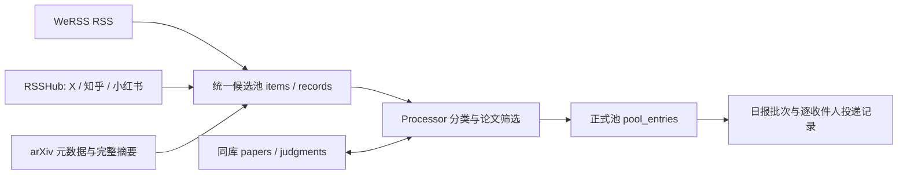

# 统一本地内容数据库

业务数据库统一为 `config/content_pool.yaml` 的 `db_path`，默认
`output/content_pool/content.sqlite3`。WeRSS 自身数据库仍属于采集服务，保存订阅、
登录状态及源文章；业务流程通过它的 RSS 接口取文，不复制账号或 Cookie 表。



## 配置与运行

- RSS 采集入口、内容池管理入口和日报入口使用同一个 `db_path`。订阅配置中的旧
  `database` 字段可以暂时保留，但必须与之相同；不一致会报错，不会静默写入第二个库。
- 论文配置默认读取同目录下的 `content_pool.yaml`。统一处理器直接共享内容池连接，
  不再打开独立论文库。论文评分方法和模型配置保持原有规则。
- arXiv 采集先保存所有返回的原始候选，再进入统一处理器。相关性不足的候选标记
  `filtered`；模型失败的候选保持可重试。同一论文的公众号解读、X 分享和 arXiv
  来源共享评分缓存，并合并到同一个正式论文条目。
- 正文日期未知时保留候选等待补全，不用 WeRSS 的抓取时间替代发布日期。
- 本地采集、处理、日报及迁移命令使用同一文件锁。任务冲突时直接运行的命令会报错；
  systemd 服务已有的 `flock` 包装会排队。`--watch` 仅在每次采集期间持锁。

```bash
# 单个平台采集也写入统一池
.venv/bin/python scripts/collect_content.py --config config/content_sources.local.yaml collect --platform wechat
# 全部来源采集、统一筛选、预览；不会发送
.venv/bin/python scripts/run_content_daily.py
# 跳过 RSS/arXiv 批量采集；处理候选时身份核验和模型仍可能联网
.venv/bin/python scripts/run_content_daily.py --skip-collect
# 按平台/状态/历史标记查看统计（也报告未知日期和论文缓存数量）
.venv/bin/python scripts/manage_content_pool.py stats
```

自定义采集测试库需显式传 `--pool-config /path/to/content_pool.yaml`。
离线论文 fixture 预览继续使用临时数据库，不污染正式数据。

## 从独立论文库迁移

全新安装无需迁移。已有 `output/papers/state.sqlite3` 时执行：

```bash
# 只读检查来源和迁移数量，不调用模型、不发送邮件
.venv/bin/python scripts/unify_content_database.py
# 自动备份目标库，再导入论文元数据、原始候选及评分缓存
.venv/bin/python scripts/unify_content_database.py --execute
```

执行前确保没有运行中的旧版本论文进程。迁移命令同时取得调度锁和内容池运行锁；
如果已有任务运行，稍后重试。备份使用 SQLite backup API，权限为 `0600`，位于
`content.sqlite3.before-unify-时间戳.bak`。源论文库原样保留。

合并在事务内完成，失败全部回滚。按来源内容摘要记录迁移，重复执行同一份源数据
返回 `already_imported`，不会增加尝试次数或复活已清理正文。目标中更高版本论文、
成功评分和已有投递记录优先保留。

原本不在候选池的旧论文标记为历史候选，不自动塞进当天日报。原有候选的历史标记、
去重和投递状态不变。需要重新处理历史时显式执行
`scripts/manage_content_pool.py process --history`；这可能调用模型。

## Supabase 运行适配

GitHub 托管部署现已支持直接读写迁移后的 PostgreSQL 表、跨实例数据库锁与日期投递去重，
详见 [GitHub Actions + Supabase 部署](github-actions-supabase.md)。本页上面的本地
SQLite 用法仍适用于默认本地模式；托管模式显式使用 `CONTENT_DATABASE_BACKEND=supabase`。
WeRSS 服务登录状态仍单独持久化；不会把它当作无状态临时容器。
